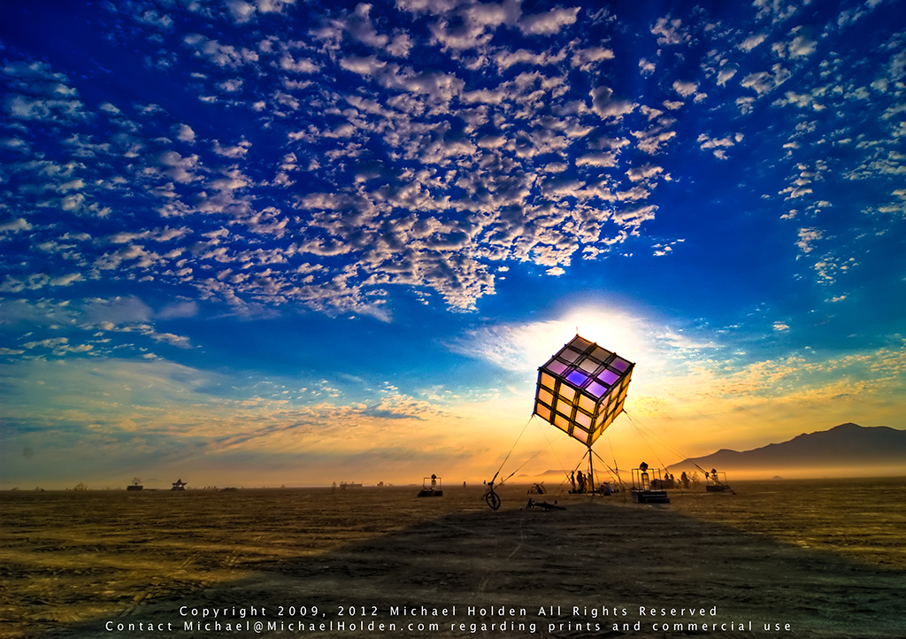
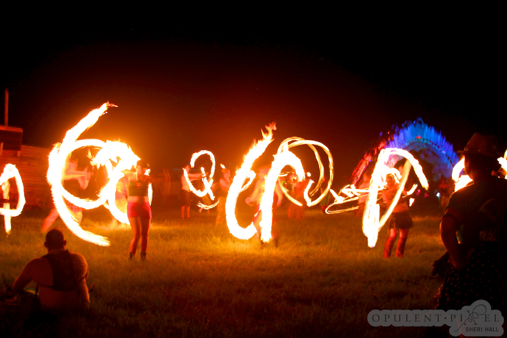

!SLIDE full-page

!SLIDE bullets incremental
# the Ball of Light #

* or how to get dusty half nekkid people dancing to your ruby codez

.notes what is the difference between nekkid and naked?

!SLIDE
# What is Burning Man? #

!SLIDE full-page

.notes so here's the man

!SLIDE full-page

.notes and here's us setting the man on fire

!SLIDE
# Art #

!SLIDE full-page

!SLIDE full-page

!SLIDE full-page

!SLIDE full-page

!SLIDE full-page

!SLIDE bullets incremental
# Act I: the project #

* giant ball
* lots of lights
* interactive with guests

.notes thanks to gregory, thanks to zynga peeps

!SLIDE full-page

.notes note the location of the BoL in the 9 o'clock keyhole, replace with licensed image

!SLIDE commandline
    $ kinectable_pipe | _
      add_gestures | _
      run_light_script.rb

    # run_light_script.rb calls into the scripts directory
      scripts/spiral.rb

!SLIDE bullets incremental
# Tech Stack #

* MS Kinect
* DMX Lighting
* Processing
* Ruby glue code

!SLIDE full-page
# MS Kinect #

.notes - replace with licensed image

!SLIDE bullets incremental
# MS Kinect: hardware #

* RGB camera, 8-bit VGA
* IR camera, 11-bit VGA
* 4 Microphone array
* USB

!SLIDE bullets incremental
# MS Kinect: software #

* Kinect for Windows SDK
* OpenNI
* OpenKinect / libfreenect
* Zigfu

.notes OpenNI is C++. OpenKinect doesn't have gesture or skeletal data. Zigfu has licensing problems. Kinect for Windows requires Windows/C#

!SLIDE bullets incremental
# `kinectable_pipe` #

* Unix philosophy
* output JSON to STDOUT
* minimally viable C++
* optionally exports bitmaps
* bundled with `homebrew`
* `github.com/marshally/kinectable_pipe`

!SLIDE commandline incremental
# `kinectable_pipe`: output #

    $ {"status":"initializing", "elapsed":0.006}
    $ {"status":"seeking_users", "elapsed":0.006}
    $ {"found_user":{"userid":1}, "elapsed":1.791}
    $ {"calibration_started":{"userid":1}, "elapsed":1.880}
    $ {"calibration_ended":{"userid":1}, "elapsed":1.965}
    $ {"skeletons":[{"userid":0,"joints":[
    {"joint":"head","X":-788.872,"Y":228.393,"Z":4137.413},
    {"joint":"neck","X":-744.583,"Y":-35.818,"Z":4025.786},
    {"joint":"l_shoulder","X":-841.367,"Y":-42.034,"Z":4088.553},
    {"joint":"l_elbow","X":-1008.685,"Y":-96.285,"Z":4267.681},
    {"joint":"l_hand","X":-867.162,"Y":-73.791,"Z":4061.549},
    {"joint":"r_shoulder","X":-647.800,"Y":-29.601,"Z":3963.020},
    {"joint":"r_elbow","X":-596.970,"Y":-272.193,"Z":4002.904},
    {"joint":"r_hand","X":-558.563,"Y":-486.768,"Z":3878.375},
    {"joint":"torso","X":-742.614,"Y":-191.020,"Z":4013.452},
    {"joint":"l_hip","X":-818.041,"Y":-351.194,"Z":4051.311},
    {"joint":"l_knee","X":-761.381,"Y":-730.943,"Z":4052.892},
    {"joint":"l_foot","X":-772.137,"Y":-991.349,"Z":3791.410},
    {"joint":"r_hip","X":-663.246,"Y":-341.250,"Z":3950.923},
    {"joint":"r_knee","X":-722.540,"Y":-718.826,"Z":3914.269},
    {"joint":"r_foot","X":-762.814,"Y":-872.354,"Z":3580.941}]}],
    "elapsed":2.010}

!SLIDE smaller
# `kinectable_pipe` #
    @@@ C
    void writeUserPosition(string *s, XnUserID id) {
      XnPoint3D com;
      userGenerator.GetCoM(id, com);

      if (fabsf( com.X - 0.0f ) > 0.1f)
      {
        char tmp[1024];

        sprintf(tmp, "{\"userid\":%u,\"X\":%.3f,\"Y\":%.3f,\"Z\":%.3f}\n", id, com.X, com.Y, com.Z);
        *s += tmp;
      }
    }

!SLIDE smaller
# `kinectable_pipe` #
    @@@ C
    void writeRGB() {
      png::image< png::rgb_pixel > output_image(imageMD.FullXRes(), imageMD.FullYRes());

      const XnRGB24Pixel* pImageRow = imageMD.RGB24Data();

      for (XnUInt y = 0; y < imageMD.YRes(); ++y)
      {
        const XnRGB24Pixel* pImage = pImageRow;

        for (XnUInt x = 0; x < imageMD.XRes(); ++x, ++pImage) // , ++pTex
        {
          output_image[y][x] = png::rgb_pixel(pImage->nRed, pImage->nGreen, pImage->nBlue);
        }
        pImageRow += imageMD.XRes();
      }
      output_image.write("rgb.png");
    }

!SLIDE
# Demo: kinectable_pipe #

!SLIDE bullets incremental
# MS Kinect: gotchas #

* only skeletons for 2 users!
* 15ft IR range
* GPL (OpenNI)
* limited gesture recognition (OpenNI)
* [joint filtering latency](http://msdn.microsoft.com/en-us/library/jj131429.aspx)
* 100ms = 1-2 beats per second of dance music

.notes OpenNI supports a (very) limited set of gestures

!SLIDE full-page

!SLIDE bullets incremental
# `kinectable_pipe`: todo #

* gesture DSL
* linux and windows installers
* de-dupe JSON output
* remove "flat" records
* use command line processor `getopt`
* wrap in web server

!SLIDE full-page
# ComScan LED #

!SLIDE full-page
# ComScan LED #

!SLIDE full-page
# ComScan LED #

* SLIDE ON ADDRESSING *

!SLIDE full-page
# ComScan LED #

!SLIDE bullets incremental
# ComScan LED: features #

* pan
* tilt
* gobo
* strobe
* dimmer

!SLIDE full-page
# Open DMX #

!SLIDE bullets incremental
# DMX lighting #

* OpenDMX
* Open Lighting Architecture
* `ola_streaming_client`
* `github.com/marshally/open_lighting_rb`

!SLIDE bullets incremental
# `open_lighting_rb` #

!SLIDE smaller
# `OpenLighting::DmxDevice` #
    @@@ Ruby
    require 'open_lighting/dmx_device'

    module OpenLighting
      module Devices
        # ComscanLed is an example subclass of DmxDevice which supplies sensible defaults
        class ComscanLed < DmxDevice
          def initialize(options = {})
            options[:points] ||= {}
            options[:points][:center] ||= {:pan => 127, :tilt => 127}
            options[:points][:origin] ||= {:pan => 127, :tilt => 127, :strobe => 8, :gobo => 0, :dimmer => 0}

            options[:points][:strobe_blackout]  ||= {:strobe => 0}
            options[:points][:strobe_open]      ||= {:strobe => 8}
            options[:points][:strobe_slow]      ||= {:strobe => 16}
            options[:points][:strobe_fast]      ||= {:strobe => 131}
            options[:points][:strobe_slow_fast] ||= {:strobe => 140}
            options[:points][:strobe_fast_slow] ||= {:strobe => 190}
            options[:points][:strobe_random]    ||= {:strobe => 247}

            options[:points][:nocolor]  ||= {:gobo => 0}
            options[:points][:white]    ||= {:gobo => 0}
            options[:points][:yellow]   ||= {:gobo => 8}
            options[:points][:red]      ||= {:gobo => 15}
            options[:points][:green]    ||= {:gobo => 22}
            options[:points][:blue]     ||= {:gobo => 29}
            options[:points][:teardrop] ||= {:gobo => 36}
            options[:points][:polka]    ||= {:gobo => 43}
            options[:points][:teal]     ||= {:gobo => 50}
            options[:points][:rings]    ||= {:gobo => 57}

            options[:points][:on]       ||= {:dimmer => 255}
            options[:points][:off]      ||= {:dimmer => 0}

            options[:capabilities] ||= [:pan, :tilt, :strobe, :gobo, :dimmer]
            options[:defaults]     ||= {:pan => 127, :tilt => 127, :strobe => 8, :gobo => 0, :dimmer => 0}

            super(options)
          end
        end
      end
    end

!SLIDE smaller
# `OpenLighting::DmxController` #
    @@@ Ruby
    # writes commands out to the device
    def write!(values=current_values)
      self.write_pipe ||= IO.popen(self.cmd, "w")
      self.write_pipe.sync = true

      # DMX only wants integer inputs
      values.map!{|i| i.to_i}

      self.write_pipe.write "#{values.join ","}\n"
      self.write_pipe.flush
    end

    def current_values
      results = []
      @devices.each do |d|
        results[d.start_address, d.start_address+d.capabilities.count] = d.current_values
      end
      # backfill unknown values with zero, in case of gaps due to starting_address errors
      results.map{|i| i.nil? ? 0 : i}.drop(1)
    end

!SLIDE bullets incremental
# `open_lighting_rb`: todo

* better DSL for non-programmers
* curves (ease in, ease out)
* more devices
* event driven animation framework

.notes  similar to [cocos2d-x](https://github.com/cocos2d/cocos2d-x)

!SLIDE bullets incremental
# `ball_of_light` #

* thor
* ruby IO classes
* POpen3

!SLIDE
# Demo: CLI #

!SLIDE smaller
# `BallOfLightController < DmxController` #
    @@@ Ruby
    module BallOfLight
    class BallOfLightController < OpenLighting::DmxController
      def initialize(options = {})
        super
        count = options[:count] || 12
        count.times do |i|
          self << OpenLighting::Devices::ComscanLed.new
        end

        def chase_sequence
          [
            4, 9, 10, 6, 3, 0,
            4, 9, 10, 6, 3, 0,
            4, 9, 10, 6, 3, 0,
            7, 11, 10, 5, 0,
            7, 11, 10, 5, 0,
            7, 11, 10, 5,
            1, 4, 8, 11, 6, 2,
            1, 4, 8, 11, 6, 2,
            1, 4, 8, 11, 6, 2,
            5, 9, 8, 7, 3, 0,
            5, 9, 8, 7, 3, 0,
            5, 9, 8, 7, 3, 0
          ].map{|i| devices[i]}
        end
      end
    end

!SLIDE bullets incremental
# `ball_of_light`: todo #

* more animators!
* visualization tools

!SLIDE full-image

!SLIDE full-page

!SLIDE full-page

!SLIDE full-page

!SLIDE full-page

!SLIDE full-page

!SLIDE bullets incremental
# Sound Activated: options #

* Kinect for Windows
* sox
* Processing

.notes MS Kinect audio is windows only, sox requires a lot of subcomponents and is fussy to build, Processing requires JRuby and couldn't get it down to the BoL computer

!SLIDE smaller
# Processing #

    @@@ Ruby
    def setup_sound
      # Creates a Minim object
      @minim = Minim.new(self)
      # Lets Minim grab sound data from mic/soundflower
      @input = @minim.get_line_in

      # Gets FFT values from sound data
      @fft = FFT.new(@input.left.size, 44100)
      # Our beat detector object
      @beat = BeatDetect.new

      # Set an array of frequencies we'd like to get FFT data for
      #   -- I grabbed these numbers from VLC's equalizer
      @freqs = [60, 170, 310, 600, 1000, 3000, 6000, 12000, 14000, 16000]

      # Create arrays to store the current FFT values,
      #   previous FFT values, highest FFT values we've seen,
      #   and scaled/normalized FFT values (which are easier to work with)
      @current_ffts   = Array.new(@freqs.size, 0.001)
      @previous_ffts  = Array.new(@freqs.size, 0.001)
      @max_ffts       = Array.new(@freqs.size, 0.001)
      @scaled_ffts    = Array.new(@freqs.size, 0.001)

      # We'll use this value to adjust the "smoothness" factor
      #   of our sound responsiveness
      @fft_smoothing = 0.8
    end

!SLIDE
# Demo #

!SLIDE bullets incremental
# Sound Activated: todo #

* better filtering for glitchy music
* animations for higher frequency
* poi spinning

!SLIDE full-page

!SLIDE full-page

!SLIDE full-page

!SLIDE full-page

!SLIDE full-page

!SLIDE bullets incremental
# Lessons #

* `homebrew` is a terrible experience for non-programmers
* your DSL isn't as good as you think it is
* gesture recognition is hard
* Burner Standard Time (BST)
* the best laid plans of mice and burners

!SLIDE full-page

!SLIDE
# Future #

!SLIDE full-page

!SLIDE full-page

!!SLIDE full-page
[flower 3](5856949131_b703939868_b_d.jpg)

!SLIDE full-page

!SLIDE full-page

![SLIDE] full-page

!SLIDE full-page

!SLIDE smaller
# Thanks #

http://www.flickr.com/photos/michaelholden/4008994607/
http://www.flickr.com/photos/carnivillain/6123549366
http://www.flickr.com/photos/meganpru/7941969980/
http://www.flickr.com/photos/meganpru/7941972128/
http://www.flickr.com/photos/retrocactus/4000633000/
http://www.flickr.com/photos/burnblue/483245983/lightbox/
http://www.flickr.com/photos/mindmorph/43322750/lightbox/
http://www.flickr.com/photos/pedrosagues/4998244684/
http://www.flickr.com/photos/mayhem/1327337131/
http://www.flickr.com/photos/alliejoel/2112424594
http://www.flickr.com/photos/michaelholden/4035684306/
http://www.flickr.com/photos/smoocherie/1330579071/
http://www.flickr.com/photos/carnivillain/2801388420
http://www.flickr.com/photos/iamuman/3907076543/
http://www.flickr.com/photos/jasonskinner/1353508944/
http://www.flickr.com/photos/mayhem/2824653688/
http://www.flickr.com/photos/carnivillain/120532283/lightbox/
http://www.flickr.com/photos/mayhem/2823831367/
http://www.flickr.com/photos/foxgrrl/3959228434/
http://www.flickr.com/photos/guillermoduran/3918766436/
http://www.flickr.com/photos/cliff_robin/2525570355
